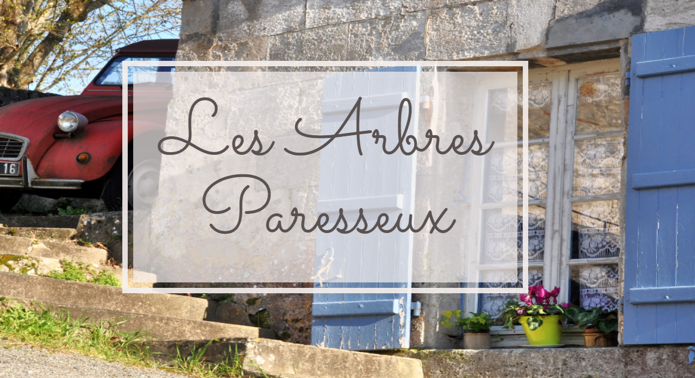

# Les Abres Paresseux

**Aim**
The aim of this project was to design and build a bespoke app which could be used as a booking system and a marketing tool for  rental holiday home.
The design of the website had to closely mirror that of the house. Namely, it had to feel feminine, modern and French.
The backend had to be capable of managing bookings made my clients and the owners of the property in a simple but secure manner.

**Description**
The website showcases Les Abres Parasseux, a holiday home in central-western France. It feels typically French without being cliched. The site's welcome area is a personal note from the owners, inviting the visitor to explore the house further.
Users can explore the site using the side bar navigation which uses a mixture of French and English. Both languages were selected so that users could navigate easily but still see some French content.
A sidebar was chosen over a permanent menu to allow for a much more immersive experience and to allow images to take centre focus.
The user can view two special feature sections, "La Maison" and "Location". The "La Maison" section features a room by room tour of the house as if the user was looking through a scrap book. A slight fade-in animation has been used to add an extra layer of finesse without being over powering.
The "Location" section follows a similar pattern and describes the local area, things to do etc.

In the reservations section, users are able to check for availability by either searching specific dates or by browsing an Ajax based calendar. If their dates are available they can submit their reservation and are automatically logged into their user account. Upon successful booking a welcome email is also sent. From their personal area users are able to edit their account details, edit their reservations and delete reservations without having to contact the owners.
The Admin user is authorised to make booking for both new and existing users.
The authenticated areas of the website use a pale green pallet as to differentiate it from the pale pink public areas.

**Features**
- All visitors can browse the site to explore the house and its setting
- Users authenticate with their email address and password
- Users can update their personal information
- Users can check availability via AJAX requests
- Users can change the dates of their bookings
- Admin users can create new bookings and amend the bookings of all users
- Admin users can search for a booking by arrival date, departure date or reservation number
- Admin users can search for a user by their email address

**Stack**
- Ruby on Rails
- Vanilla JS
- Sass
**Hosting**
- Heroku
- https://lesarboles.herokuapp.com/

I am really happy with how this project turned out. It has been nice to design something so different to other modern websites which are typically more masculine and grey!
